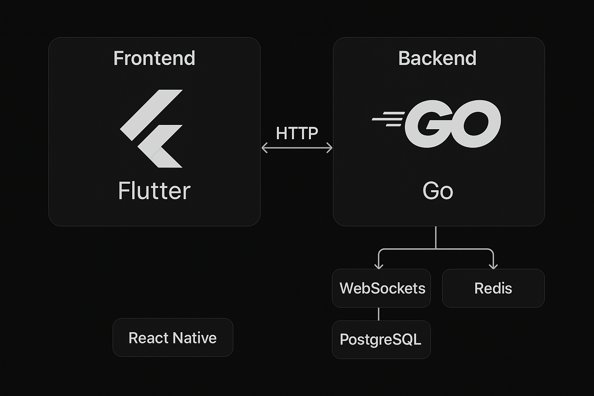

# 📱 Alanogram App

A cross-platform messenger with real-time messaging, built on a modern stack.
Works on **Android, iOS, and Web**. 🚀

---

## ⚡️ Tech Stack

### Frontend

- [Flutter](https://flutter.dev/) → cross-platform UI (Android, iOS, Web, Desktop).

### Backend

- [Go](https://go.dev/) → fast and optimized backend.
  _(alternative for quick start: [NestJS](https://nestjs.com/))_

### Database

- **PostgreSQL** → users & messages storage.
- **Redis** → cache, online status, pub/sub for real-time.

### Real-time

- **WebSockets** → two-way communication (client ↔ server).

### Infrastructure

- **Docker** → containerization.
- Any cloud provider (AWS, GCP, DigitalOcean, Render, etc).

---

## 🚀 Features (MVP)

- User registration & login (JWT).
- Chat list and contacts.
- Real-time messaging (WebSocket).
- Push notifications (Firebase + APNs).
- Offline mode (local SQLite → sync on reconnect).
- HTTPS + basic encryption.

---

## 🛠 Installation & Run

### Backend

```bash
# Clone repository
git clone https://github.com/your-username/messenger-app.git
cd messenger-app/backend

# Run via Docker
docker-compose up --build
```

---

### Frontend (Flutter)

```bash
cd messenger-app/frontend

# Run in debug mode
flutter run
```

### Diagram



Services:

- `api` → REST API
- `ws` → WebSocket server
- `db` → PostgreSQL
- `redis` → Redis

---

## 📌 Roadmap

- [ ] MVP (text chats).
- [ ] Group chats.
- [ ] Media sharing (photos, videos).
- [ ] Video calls (WebRTC).
- [ ] End-to-End Encryption (Signal Protocol).

---

## 👨‍💻 Contribution

Pull requests and issues are welcome ❤️
Feel free to fork this repo if you’d like to contribute.

---

## 📜 License

This project is **source-available**.
🔒 **Viewing is allowed, usage is prohibited.**

[](./LICENSE)

See [LICENSE](./LICENSE) for details.
